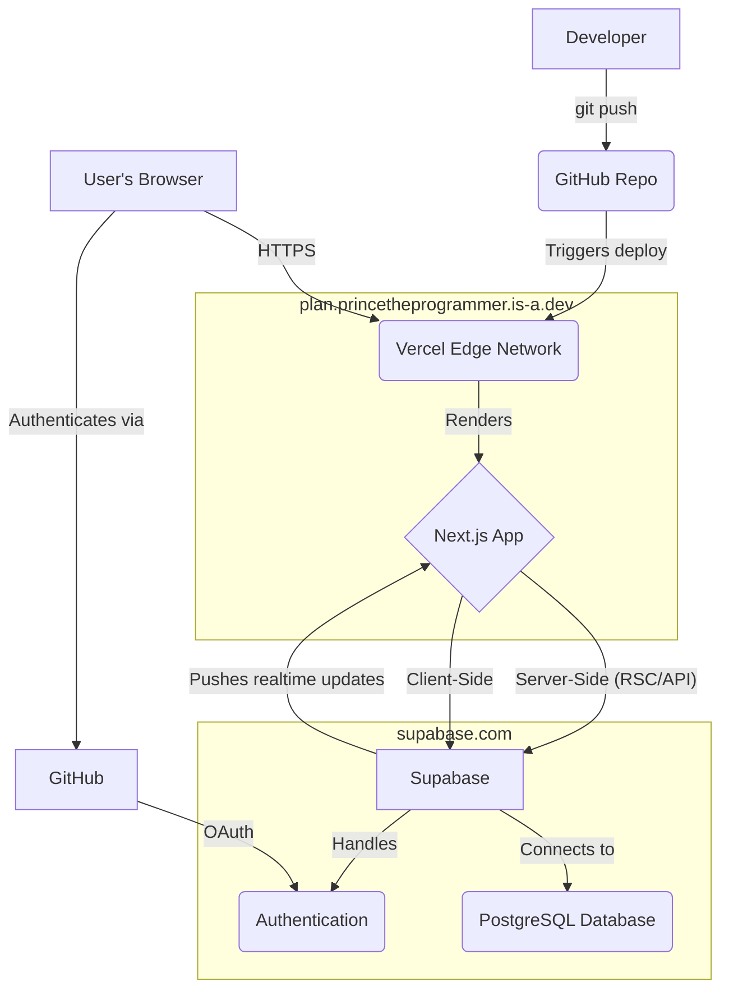

# Architecture Overview

This document outlines the system architecture for **Plan**, a personal idea management and execution platform.

## Core Philosophy

- **Serverless First:** The entire application is built on serverless and managed services to ensure zero-cost hosting and infinite scalability with minimal operational overhead.
- **Component-Based FE:** The frontend is built with a clear component hierarchy, leveraging `shadcn/ui` for a consistent and professional look and feel.
- **Database-as-Backend:** Supabase provides the core backend services, including database, authentication, and real-time capabilities, allowing the team to focus on feature development rather than backend maintenance.
- **GitOps for CI/CD:** All code is managed in a Git repository, and deployments are automated through Vercel's integration with GitHub.

## Technology Stack

| Layer             | Technology                                      | Rationale                                                     |
| ----------------- | ----------------------------------------------- | ------------------------------------------------------------- |
| **Frontend**      | Next.js 14 (App Router) + TypeScript            | Modern React framework with SSR, RSC, and strong typing.      |
| **UI Components** | Tailwind CSS + shadcn/ui                        | Utility-first CSS for rapid styling and accessible components.|
| **Backend**       | Supabase                                        | Open-source Firebase alternative (Postgres, Auth, Realtime).  |
| **Database**      | Supabase Postgres                               | Robust, scalable, and feature-rich relational database.       |
| **Authentication**| Supabase Auth (GitHub OAuth)                    | Managed authentication with built-in RLS integration.         |
| **Deployment**    | Vercel                                          | Seamless, automated deployments from GitHub with a global CDN.|
| **Domain**        | is-a.dev                                        | Free, developer-focused domain provider.                      |

## System Diagram

## Future Expansion

The current monolithic architecture on a single subdomain (`plan.princetheprogrammer.is-a.dev`) is intentional for MVP speed. Future iterations may split services into dedicated subdomains for better separation of concerns:

-   `auth.princetheprogrammer.is-a.dev` (SSO service)
-   `db.princetheprogrammer.is-a.dev` (Database admin)
-   `files.princetheprogrammer.is-a.dev` (File storage)
-   `ideas.princetheprogrammer.is-a.dev` (Public idea board)

This will be achieved by deploying different applications or services and routing them via DNS, without fundamentally changing the core serverless philosophy.
