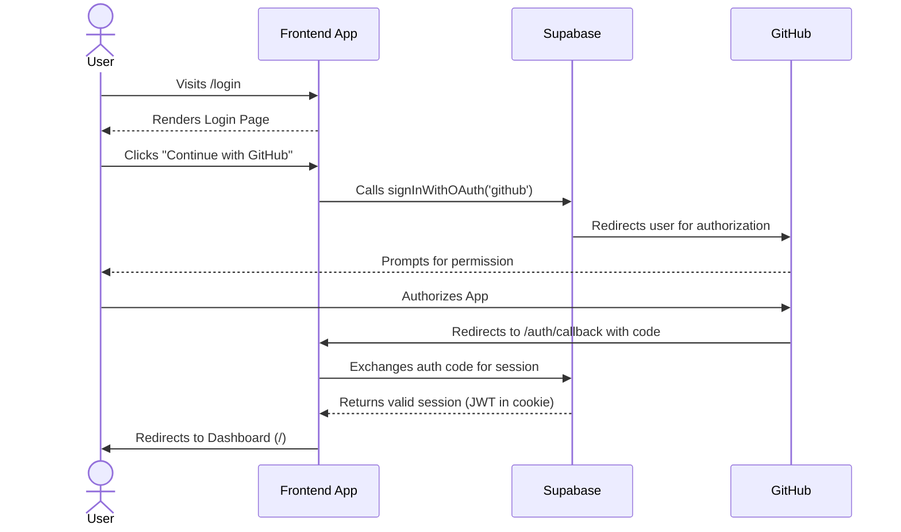
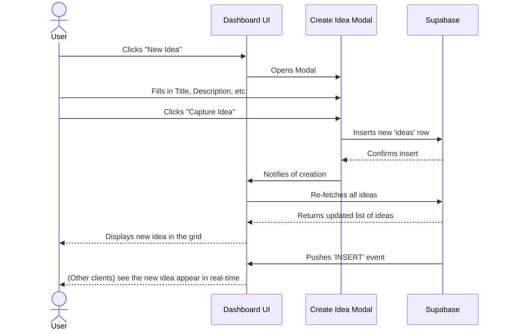

# High-Level Design (HLD)

This document describes the high-level design and user flows for the **Plan** application.

## 1. System Components

-   **Frontend Application:** A Next.js 14 single-page application (SPA) responsible for all user interactions. It communicates with Supabase for data and authentication.
-   **Supabase Backend:** A managed service providing the database, authentication, and a real-time API. It is the single source of truth for all data.
-   **GitHub:** An external service used for OAuth 2.0 authentication.

## 2. User Flows

### 2.1. User Authentication Flow

This flow describes how a user signs in and gets an active session.

### 2.2. Idea Management Flow

This flow covers creating and viewing ideas.

## 3. Key Features (Phase 1)

-   **GitHub Authentication:** Users can sign up and log in using their GitHub account.
-   **Idea Capture Form:** A modal allows users to capture a new idea with a title, description, and category.
-   **Priority Auto-scoring:** The database automatically calculates a `priority_score` based on `impact`, `effort`, and `excitement`.
-   **Ideas Dashboard:** A central view where users can see all their ideas in a grid, with the ability to filter by status or priority.
-   **Real-time Sync:** The dashboard listens for real-time changes from Supabase and updates the UI instantly when new ideas are created.
-   **Dark Mode UI:** The application uses a professional, dark theme by default.

## 4. Security Model

-   **Row Level Security (RLS):** All tables in the Supabase database have RLS enabled.
-   **Ownership Policy:** Policies are in place to ensure users can only `SELECT`, `INSERT`, `UPDATE`, or `DELETE` their own data. The `user_id` column in each table is checked against the authenticated user's ID (`auth.uid()`).
-   **JWT-based Sessions:** Supabase Auth manages sessions using JSON Web Tokens, which are stored securely in cookies.
